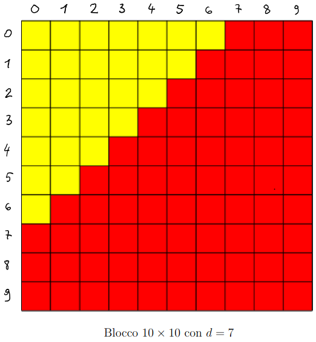

# Progetto di Metodi del Calcolo Scientifico - Var. 2

Lo scopo di questo progetto e\` di utilizzare l’implementazione della DCT2 in un ambiente open source e di studiare gli effetti di un algoritmo di compressione tipo jpeg (senza utilizzare una matrice di quantizzazione) sulle immagini in toni di grigio. Comprende la implementazione di un codice e la scrittura di una relazione da consegnare al docente.

## Prima Parte

Implementare la DCT2 come spiegata a lezione in un ambiente open source a vostra scelta e confrontare i tempi di esecuzione con la DCT2 ottenuta usando la libreria dell’ambiente utilizzato, che si presuppone essere nella versione fast (FFT). In particolare, procurarsi array quadrati N×N con N crescente e rappresentare su un grafico in scala semilogaritmica (le ascisse saranno le pure quantita\` scalari mentre le ordinate il logaritmo) al variare di N il tempo impiegato ad eseguire la DCT2 col vostro algoritmo fatto in casa e con l’algoritmo della libreria. I tempi dovrebbero essere proporzionali a $N^3$ per la DCT2 fatta in casa e a $N^2$ per la versione fast (piu\` precisamente a $N^2 log(N)$). I tempi ottenuti con la versione fast potrebbero avere un andamento irregolare dovuto al tipo di algoritmo utilizzato. Nella relazione includete anche un breve resoconto preliminare su questa parte.

## Seconda Parte

Scrivere un software che esegua i seguenti task:

- Creare una semplice interfaccia in modo che l’utente possa scegliere dal filesystem un'immagine .bmp in toni di grigio;

- permettere all’utente di scegliere:

    * un intero $F$ che sara\` l'ampiezza delle finestrelle (macro-blocchi) in cui si effettuera\` la DCT2;
    * un intero $d$ compreso tra 0 e (2F −2) che sara\` la soglia di taglio delle frequenze (vedi sotto).

- suddividere l'immagine in blocchi quadrati f di pixel di dimensioni $F \times F$ partendo in alto a sinistra, scartando gli avanzi;

- per ogni blocco f eseguire le seguenti operazioni:

    * applicare la DCT2 (della libreria): c = DCT2(f);
    * eliminare le frequenze $c_{kl}$ con $k + l \geq d$ (sto assumendo che le frequenze partano da 0: se d = 0 le elimino tutte, se d = (2F − 2) elimino solo la piu\` alta, cio`e quella con k = F − 1, ℓ = F − 1). In sostanza bisogna eliminare i coefficienti in frequenza a destra della diagonale individuata dall'intero d, come esemplificato qui sotto: abbiamo F = 10 e d = 7. I coefficienti da eliminare sono indicati in rosso;
    * applicare la DCT2 inversa all’array c cos\`ı modificato: ff = IDCT2(c);
    * arrotondare ff all’intero piu\` vicino, mettere a zero i valori negativi e a 255 quelli maggiori di 255 in modo da avere dei valori ammissibili (1 byte);

- ricomporre l'immagine mettendo insieme i blocchi ff nell'ordine giusto;

- visualizzare sullo schermo affiancate: l'immagine originale e l'immagine ottenuta dopo aver modificato le frequenze nei blocchi;

## Consegna

Note:

- Nella relazione fornite una descrizione della struttura (incluso il linguaggio utilizzato, etc..) del codice implementato e fate qualche esperimento con le immagine proposte sul sito E-learning o con altre a vostra scelta; infine commentate i risultati. All’esame potra\` essere richiesto di eseguire il vostro software su immagini fornite dal docente al momento.

- Nella relazione riportate parti del vostro codice al fine di rendere piu\` chiara l'esposizione e notizie sulla libreria utilizzata per le trasformate di Fourier;

- All’esame portate un computer in modo che possiamo far girare il vostro programma su parametri (e immagini) scelti dal docente;

- La relazione dovra\` essere consegnata almeno 3 giorni (=72 ore) prima dell'esame;
